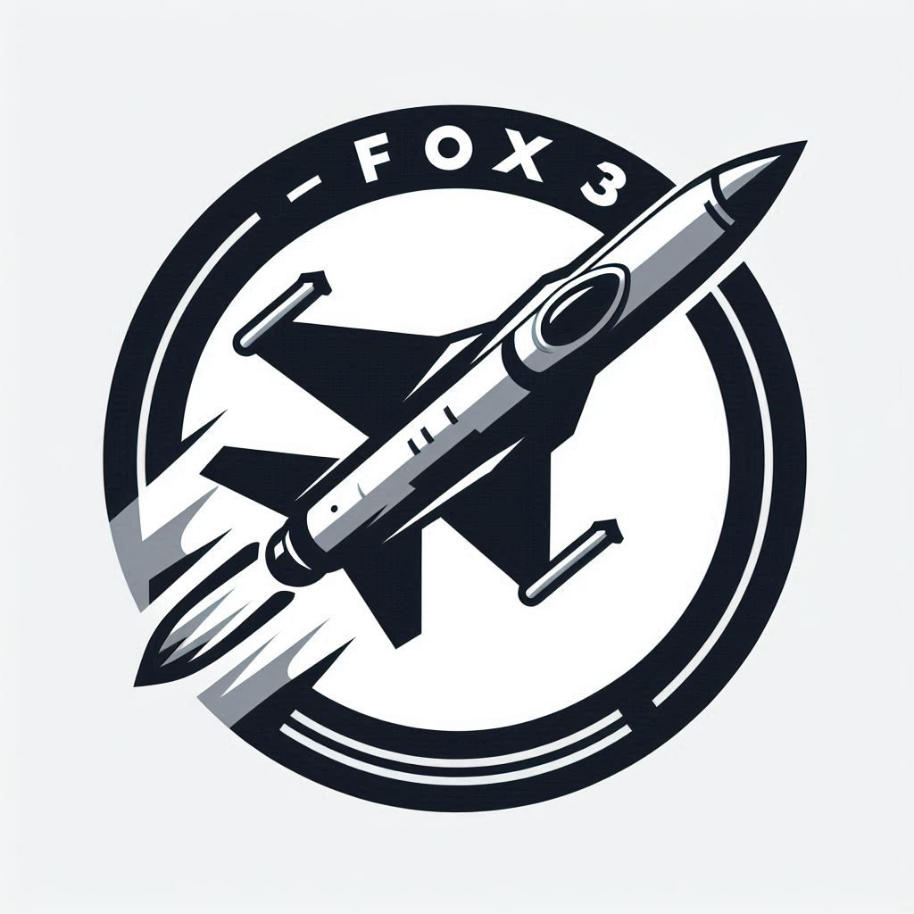

# Fox3

Fox3 é um micro framework desenvolvido por mim mesmo, Maurício Sipmann. Ele visa
auxiliar no desenvolvimento sem utilizar sistemas de third-party e pacotes adicionais.
É para ser utilizado em coisas simples e sem muito rodeios, testes e afins.

# Todos
- [ ] Handle dependency injection in controllers constructor
- [ ] Handle dependency injection in controllers methods
- [ ] A way to write tests

# Instalação

Habilitar SOPA_PHP extension

- Exemplo Chave MDFE
512407123456780001955811234511678901231  - protocolo: 135230000000000    - municipio: 5103403   (cuiaba)

# TODOS
- [ ] Fazer o parse a seguir para caso a leitora leia o QRCode https://www.sefaz.mt.gov.br/cte/qrcode?chCTe=51240734806256000102570010000763151418202663&tpAmb=1
