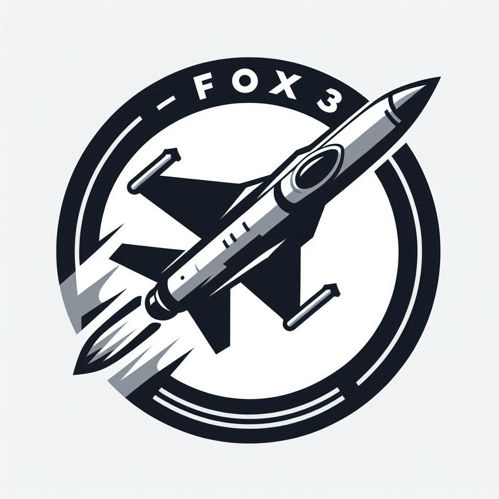

# Fox3

Fox3 é um micro framework desenvolvido por mim mesmo, Maurício Sipmann. Ele visa
auxiliar no desenvolvimento sem utilizar sistemas de third-party e pacotes adicionais.
É para ser utilizado em coisas simples e sem muito rodeios, testes e afins.

# Todos
- [ ] Handle dependency injection in controllers constructor
- [ ] Handle dependency injection in controllers methods
- [ ] A way to write tests
